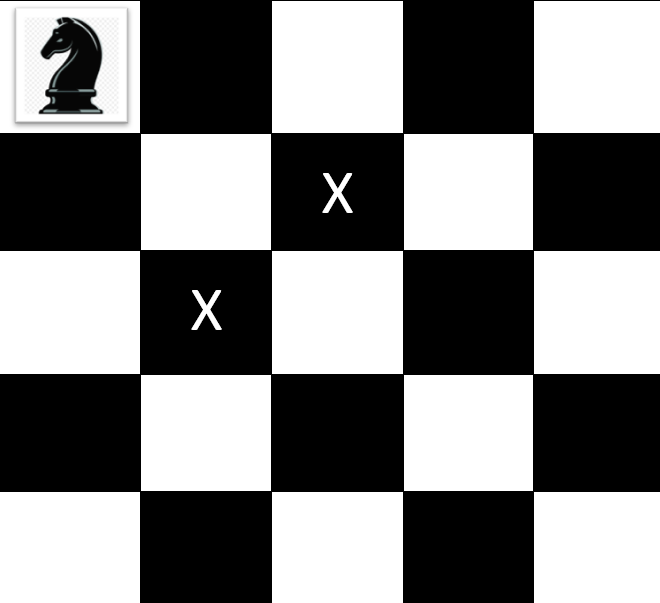
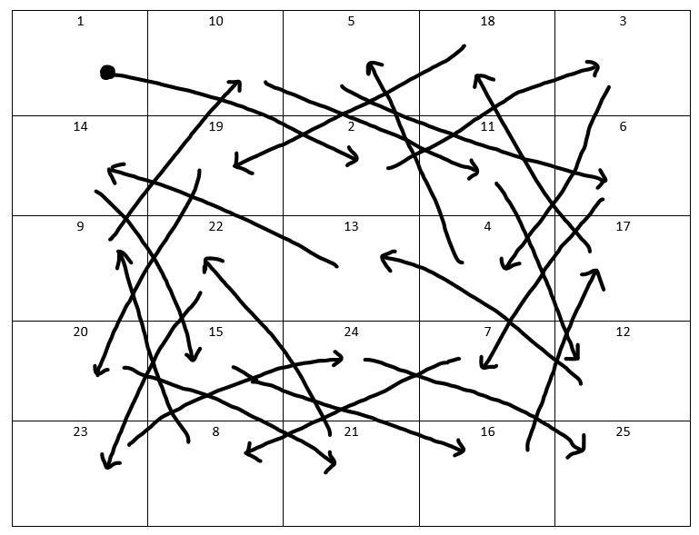

# DAA E & D Quiz2
## Knight's Tour Problem Using DFS (Depth First Search) Algorithm
---
### Group 24 YEP PAA
- Fadhil Dimas Sucahyo (05111940000212)
- Naufal Fabian Wibowo (05111940000223)
---
## Problem
The Knight’s Tour is a sequence of moves of knight on a chessboard such that the knight visits every square exactly once. If the knight ends on a square that is one knight’s move from beginning square (so that it could tour the board again immediately, following the same path), the tour is closed; otherwise. It is open


## Problem Analysis
The knight’s tour puzzle is played on a chess board with a single chess piece, the knight. The object of the puzzle is to find a sequence of moves that allow the knight to visit every square on the board exactly once.

One sequence is called a “tour”. 

Limiting the problem:
 - Using 5 x 5 size chess board
 - Start initial at 1,1 (x,y)


In this case we will use the 5 x 5 size board. The upper bound on the number of possible 5-5 chessboards is known to be xxxxx ; however there are still even more possible dead ends.

We will solve the problem using 2 main steps which is:
 - Represent the legal moves of a knight on a chessboard as a graph.
 - Use a graph algorithm  to find a path where every vertex on the graph is visited exactly once.

Building the knight’s tour graph
To represent the knight’s tour problem as a graph we will use the following 2 ideas which is:
 - Each square on the chessboard can be represented as a node in the graph.
 - Use a graph algorithm to find a path through the graph of length rows x columns where every node is only visited exactly once.

In this case we will use Python dictionary to hold our graph.

## Design and Analysis Algorithm

Implementing algorithm on knight’s tour

The search algorithm we will use to solve the problem is the Depth First Search (DFS) algorithm. The depth first search creates a search tree by exploring one branch of the tree as deeply as possible.

The depth first exploration of the graph is exactly what we need in order to find a path with exactly 24 edges. We will see that when the depth-first search algorithm finds a dead end (a place in the graph where there are no more possible moves) it backs up the tree to the next deepest vertex that allows it to make a legal move.

## Source Code
Source Code can be read in [this Source code](knightTour.py)

### How to run Program
1. Clone Repository to local Repository.
2. Run knightTour.py
3. input board size (n) and time limit (in seconds).

## Output
Output for 5x5 Board size.
```
A solution found. 
[[1, 1], [3, 2], [5, 1], [4, 3], [3, 1], [5, 2], [4, 4], [2, 5], [1, 3], [2, 1], [4, 2], [5, 4], [3, 3], [1, 2], [2, 4], [4, 5], [5, 3], [4, 1], [2, 2], [1, 4], [3, 5], [2, 3], [1, 5], [3, 4], [5, 5]]
Execution time is 0.16220712661743164 seconds
Searched with deep first search method. 
Number of nodes expanded: 3421
```

### Visualization of the solution


### Note:
Although the score is based on contributions on github, in this project we have some problems in Pushing commit in github and renaming source code name resulting in some difference in contribution percentage. Therefore we hope the scores are distributed fairly for the two of us

